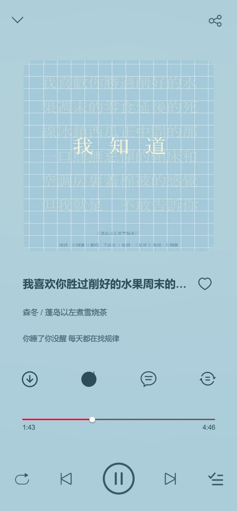
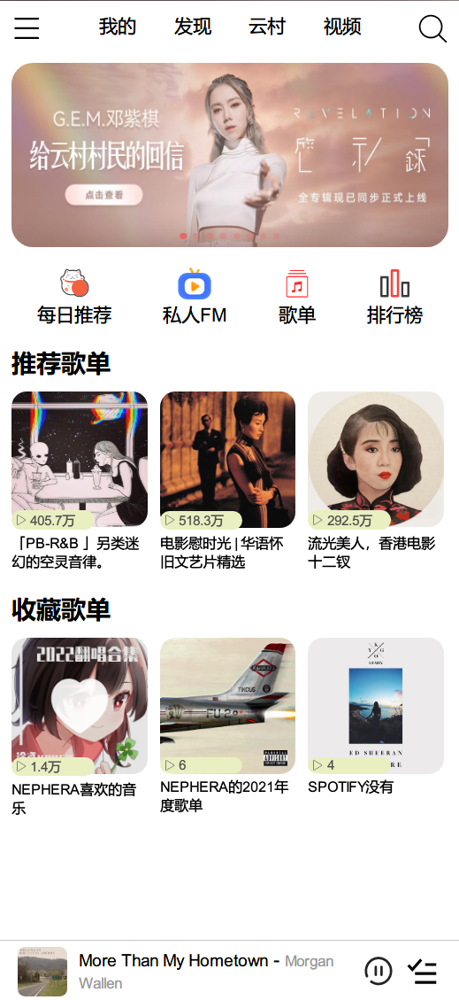
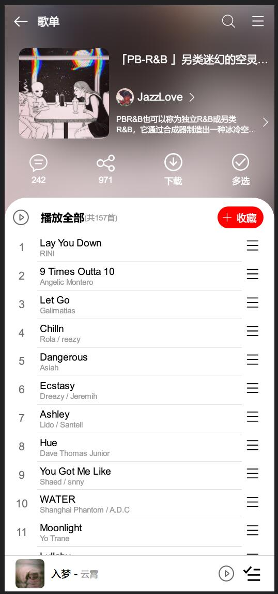
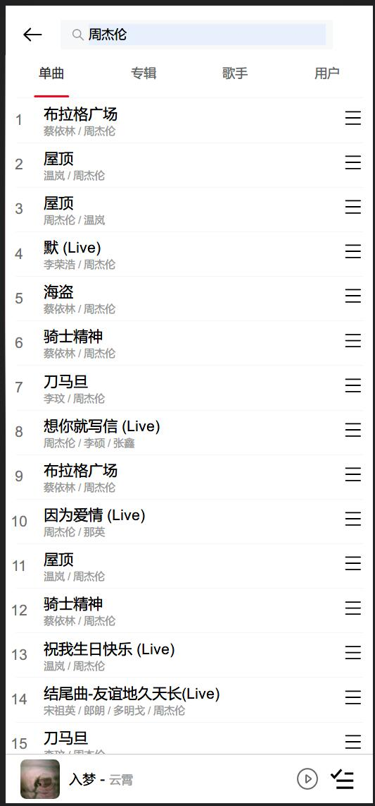
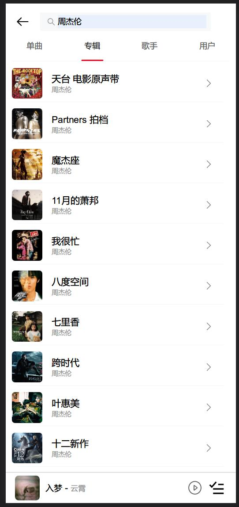
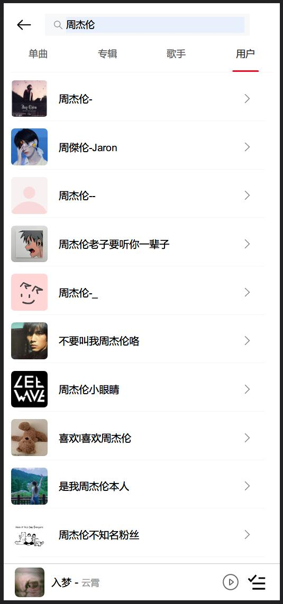
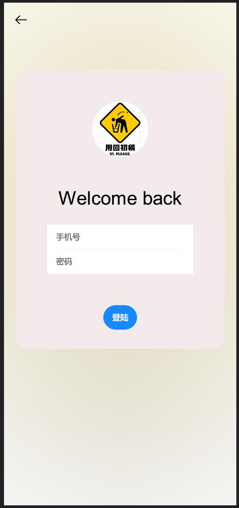

# neteasecloudmusic-vue

## Description

基于vue-cli进行构建，vue3全家桶开发，使用vant组件库(利用unplugin-vue-components进行组件的自动引入)，css部分使用less语法编写，封装axios请求。

使用前需要启动网易云NodeJS后端API，默认地址为localhost:3000

## 界面展示 ⭐
















## 项目结构

### /public

/js/rem.js --> rem布局，自适应大小

index.html --> 引入rem.js

### /src/components

#### /global

player_footer.vue --> 底部播放器，常驻

player_main.vue --> 播放详情页

#### /home

func_list.vue --> 首页四个功能按钮（功能暂未实现

playlist.vue --> 首页推荐歌单

swipe.vue --> 首页轮播图

tool_bar.vue --> 首页顶部导航栏（实现了搜索和'我的'部分

#### /playlist

playlist_top.vue --> 歌单页面顶部描述区域

playlist_songs.vue --> 歌单列表

#### /search

main_search.vue --> 全局搜索（目前实现歌曲/专辑/歌手/用户搜索

#### /user

login.vue --> 登陆页面（暂时无法登录，code400
*update : fixed
user.vue --> 用户页面（可以退出登陆

### /requests

request.js --> 实现对网易云接口的调用，返回结果

### /router

index.js --> 实现页面相关路由

### /store

index.js --> 使用vuex进行数据存储

## Project setup

```
npm install
```

### Compiles and hot-reloads for development

```
npm run serve
```

### Compiles and minifies for production

```
npm run build
```
